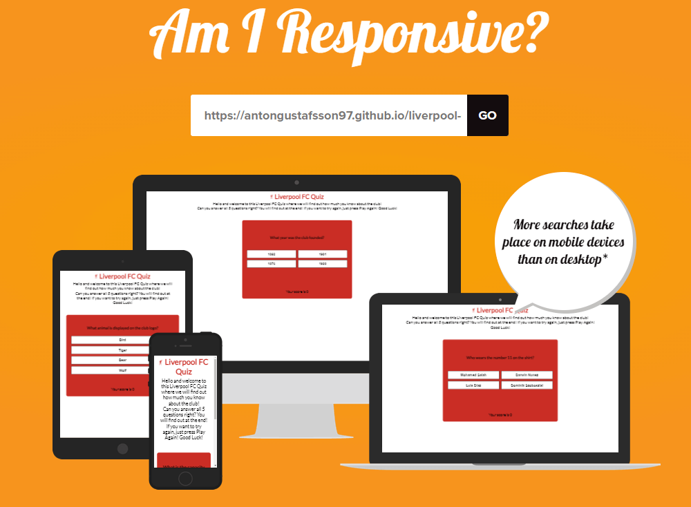
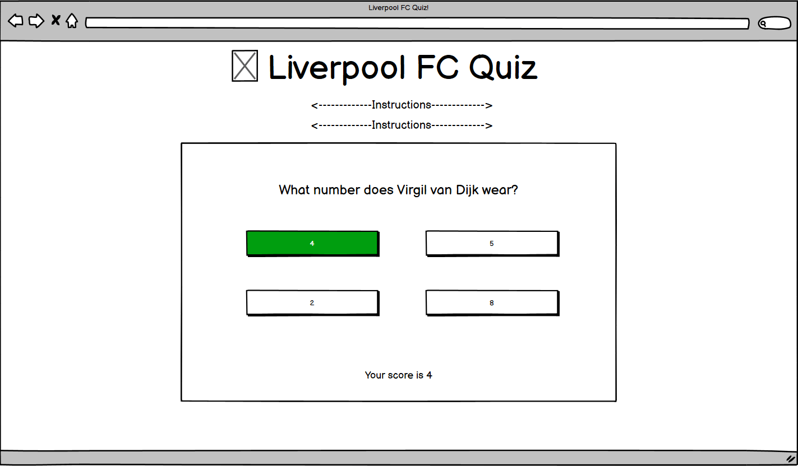
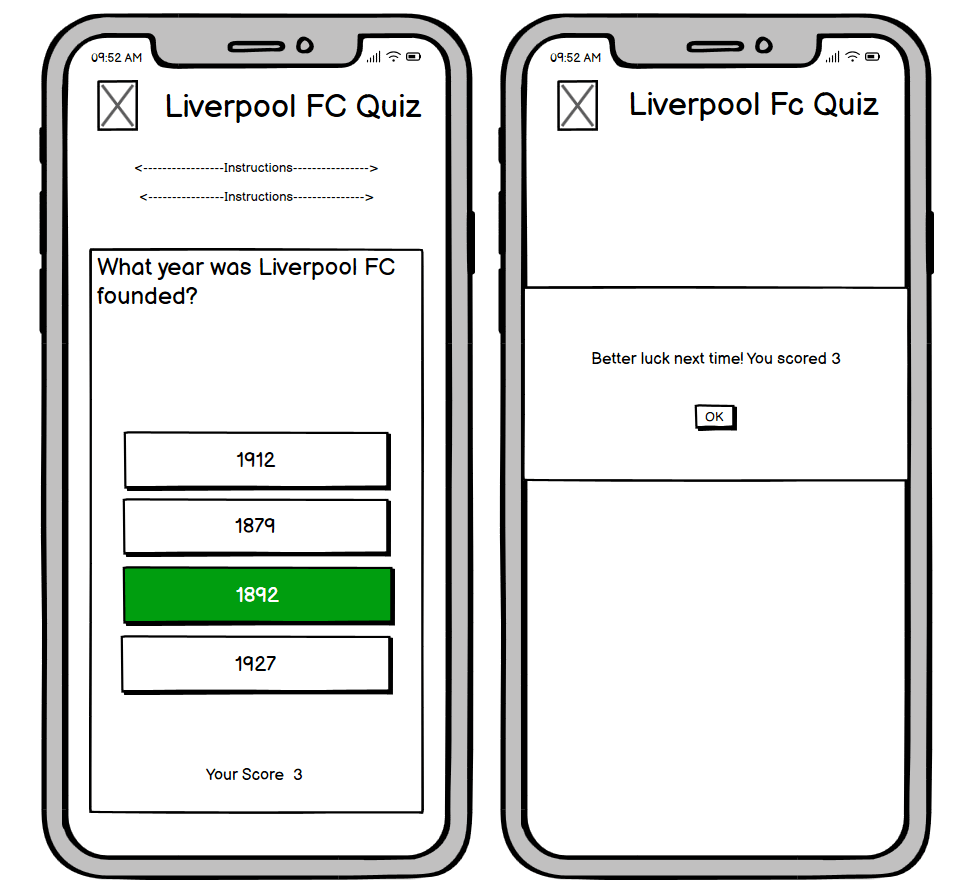
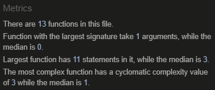
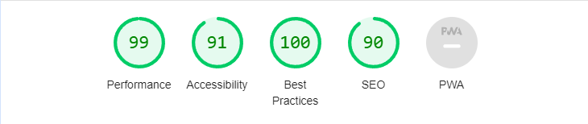

# The Liverpool Quiz

The Liverpool Quiz is a fun little quiz to test your knowledge about the clubs history up until today.

5 of the 15 questions will randomly get choosen to the round and your job is to pick the correct answer out of the four possible.

You can do the quiz as many times as you want and hopefully learn some new things about Liverpool FC.

The live link can be found here - [Liverpool FC Quiz](https://antongustafsson97.github.io/liverpool-quiz/)

## Site Owner Goals
- To Provide users with a quiz that is full of knowledge and that is simple to navigate.
- To provide the user with a site that looks clean and simple and is fully responsive.
- To make the user wanna come back and improve the score.

## First Time User
- As a first time user i want to understand what im look at and what the game is about.
- As a first time user i want to be able to start the quiz and challange myself to a game of fun questions.

## Returning User
- As a returning user i want different questions.

## Frequent User
- As a frequent user i want to be able to beat my score from last time.

## Design

### Imagery and colors
- The imagages and colors used on this site are used to represent Liverpool FC in the best way.
- The red color was choosen because the club is associated with it and among the fans, Liverpool are often called "The Reds".

### Fonts
- The font that is used throughout the site is Lato followed by Sans-seriff as a backup in case the main-font is not being imported correctly.

### Layout

- The site is a single page with focus on the quiz. No distractions. The quiz is live once you enter the site so you can start playing instantly.

### Wireframes

Wireframes were created using Balsamiq.

Desktop Wireframe

Mobile Wireframe

## Features

### Homepage
- The site is just one page so the homepage is displaying the quiz instantly for the user to start playing.

### Features to improve the site
- Create a leaderboard so that users can battle among each other who has the greater knowledge.
- Create more questions so that users are less likely to get the same questions if they want to play multiple times.

## Testing

### Validator testing
-#### HTML
   - No errors were shown when passing the HTML file through the W3C Markup Validator
   - [HTML Result](https://validator.w3.org/nu/?doc=https%3A%2F%2Fantongustafsson97.github.io%2Fliverpool-quiz%2F)

-#### CSS
   - No errors were shown when passing the CSS file through the W3C CSS Validator
   - [CSS Result](https://jigsaw.w3.org/css-validator/validator?uri=https%3A%2F%2Fantongustafsson97.github.io%2Fliverpool-quiz%2F&profile=css3svg&usermedium=all&warning=1&vextwarning=&lang=sv) 

-#### JavaScript
   -No errors were shown when passing the javaScript file through  
   -   

###
- The site achieved the following score by lighthouse

### Game Testing
- The quiz has been tested multiple times to ensure that random questions are displayed every time.
- The quiz has been tested to ensure that when you score 4 or higher, the display showing after the quiz is done, telling you "Great Job!
- The quiz has been tested to ensure that when you score 3 or lower, the display showing after the quiz is done, telling you "Better luck next time!"
- The button either turn green on correct answer or red on incorrect answer.
- The "play again" button displays after you finish the quiz.
- The score updates when you answer correctly.

### Browser testing
- The website was tested on Firefox, Safari, Google Chrome and Microsoft edge with no problems.

### Device testing
- The site was tested on desktop, laptop and mobiles such as Iphone 13 Pro, Iphone 11 and Samsung Galaxy S20 with no issues.4

## Technologies Used

### Languages
-JavaScript
-CSS3
-HTML5

### Frameworks - Libraries - Programs used
-[W3C](https://www.w3.org/) - Used to validate HTML and CSS.
-[Balsamiq](https://balsamiq.com/) - Used to create Wireframes.
-[Am I Responsive](https://amiresponsive.co.uk/) - Used to test if the site is responsive.
-[TinyPNG](https://tinypng.com/) - Used to make images smaller in file size without changing the quality.
-[GitHub](https://github.com/) - User for hosting and version controll.
-[Font Awesome](https://fontawesome.com/) - Used for selecting fav icon.
-[Chrome Dev Tools](https://developer.chrome.com/docs/devtools/) - Used for debugging, testing code, and overall development.
-[Cleanpng](https://www.cleanpng.com/) - Used to remove background from images.

## Deployment

The site was deployed using GitHub pages. The following steps were used:

1. Go to your repository on GitHub.com
2. Go to settings.
3. Select "pages" from the menu on the left.
4. Click "Deploy from a branch" and select "main"
5. After you select the "main" branch, click save.
6. The deployment starts and you can refresh the page in a couple of minutes to see your link to the site.

## Credits

### Media
The Liverbird displayed on the site is taken from Pinterest.

### Resources
[Stack Overflow](https://stackoverflow.com/) 
[W3Schools](https://www.w3schools.com/)

- Stack Overflow helped a lot when trying to figure out how to shuffle an array. [How to shuffle and array](https://stackoverflow.com/questions/2450954/how-to-randomize-shuffle-a-javascript-array)

## Acknowledgments
My Mentor Antonio for all his help and advice during the project.

Inpiration for this readMe came from AliOKeeffe.

